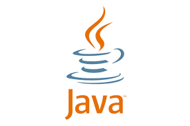

<h1 align="left" id="kaaneneskpc-title">:wave: Hello there! I'm Kaan Enes KAPICI</h1>

  
  
  
  

-:office: &nbsp;I'm an **Application Engineer** at **QNB Finansbank - IBTECH** and Developers Group Organizer at   
-:seedling: &nbsp;I’m currently learning **Kotlin** and **Flutter** 
-:speech_balloon: &nbsp;Fun Fact : **Blockchain** and **Formula-1** 

## ✉️ Find me on:

 

 

 

 

## Contact me:

 
 
  

 

> Tools - Languages - Libraries

<table>
  <tr>
    <td align="center" width="96">
      
       Android
    </td>
    <td align="center" width="96">
      
       Kotlin
    </td>
    <td align="center" width="96">
      
       Jetpack
    </td>
    <td align="center" width="96">
      
       Java
    </td>
    <td align="center" width="96">
      
       Flutter
    </td>
    
  </tr>
</table>

